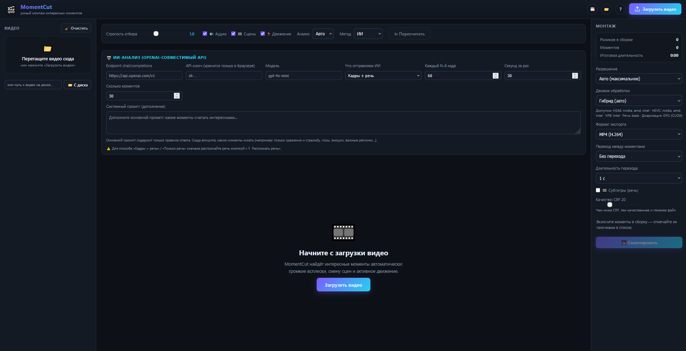

# 🎬 MomentCut — умный монтаж интересных моментов

   

Веб-приложение для автоматического поиска **интересных моментов** в видео
(одном или нескольких, любой длины) и сборки из них готового ролика. Всё
выполняется локально на вашем компьютере — видео никуда не отправляются
(кроме случаев, когда вы сами подключаете внешний API).

- 📥 Загрузка видео (drag&drop или кнопкой) и импорт «с диска» по пути
- 🧠 Автоматический анализ «интересности» (аудиоэнергия, смена сцен, движение)
- 🤖 ИИ-анализ через OpenAI-совместимый API (кадры и/или распознанная речь)
- 🗣 Распознавание речи (локально или внешним API) + 🎭 разделение по голосам
- ✏️ Редактирование моментов на таймлайне, зум, поиск по словам
- ✂️ Сборка с движками GPU/CPU, переходами, субтитрами и форматами экспорта

---

## 🚀 Быстрый старт

Если **Python 3.12** и **ffmpeg** уже установлены — достаточно нескольких команд
(подробная пошаговая установка — ниже, в разделе «Установка»):

```powershell
# из корня проекта
python -m venv .venv
.\.venv\Scripts\Activate.ps1
pip install -r requirements.txt
.\.venv\Scripts\python.exe -m uvicorn backend.main:app --host 127.0.0.1 --port 8000
```

Затем откройте браузер: **http://127.0.0.1:8000**

---

## 🖼 Скриншоты



---

## 📋 Требования

| Компонент | Зачем | Обязательно? |
|-----------|-------|--------------|
| **Windows 10/11 (64-bit)** | ОС приложения | ✅ Да |
| **Python 3.12** (64-bit) | Запуск сервера и все расчёты | ✅ Да |
| **ffmpeg + ffprobe** | Декодирование, анализ, монтаж | ✅ Да |
| **NVIDIA GPU + драйвер 610+/CUDA 12.6** | Ускорение речи (whisper) и диаризации | ⭕ Нет (опционально) |
| **Токен Hugging Face** | Скачивание закрытых моделей диаризации | ⭕ Нет (для 🎭) |
| **Интернет** | Скачивание моделей речи и зависимостей | ⭕ Только при первом запуске |

> Для аппаратного **кодирования** монтажа подойдёт любая видеокарта
> (NVIDIA NVENC / AMD AMF / Intel QSV). Если кодер недоступен — приложение
> автоматически переключится на CPU.

---

## 🚀 Установка (пошагово)

### Шаг 1. Установите Python 3.12

1. Скачайте установщик с [python.org/downloads](https://www.python.org/downloads/)
   (Python **3.12.x**, 64-bit).
2. При установке **обязательно отметьте галочку**:
   - ✅ **Add Python to PATH** — иначе команда `python` не будет видна.
3. После установки проверьте в новом окне терминала (PowerShell):
   ```powershell
   python --version   # должно показать Python 3.12.x
   ```


### Шаг 2. Установите ffmpeg

MomentCut использует ffmpeg/ffprobe для извлечения аудио, кадров, нарезки
и склейки. Утилиты ищутся по `PATH`, а также автоматически в
`C:\ffmpeg\<любой вариант>\bin`.

1. Скачайте **статическую** сборку ffmpeg:
   [gyan.dev/ffmpeg/builds](https://www.gyan.dev/ffmpeg/builds/) →
   *ffmpeg-release-essentials.zip* (или *ffmpeg-release-full.zip*).
2. Распакуйте архив так, чтобы получилось:
   ```
   C:\ffmpeg\ffmpeg-...-essentials_build\bin\ffmpeg.exe
   C:\ffmpeg\ffmpeg-...-essentials_build\bin\ffprobe.exe
   ```
   (папка `bin` внутри может называться иначе — это нормально, приложение
   найдёт её рекурсивно по `C:\ffmpeg`).
3. **Добавьте папку `bin` в PATH пользователя**:
   - `Win` → «Изменение переменных среды текущего пользователя» →
     «Переменные среды…» → переменная `Path` → «Изменить» → «Создать»:
     ```
     C:\ffmpeg\ffmpeg-...-essentials_build\bin
     ```
   - Нажмите OK везде и **перезапустите терминал/компьютер**.
4. Проверьте:
   ```powershell
   ffmpeg -version   # должно показать версию ffmpeg
   ffprobe -version
   ```

> Приложение работает и без PATH (ищет `C:\ffmpeg\**\bin` само), но наличие
> PATH упрощает диагностику и требуется для диаризации (см. шаг 5).

### Шаг 3. Создайте виртуальное окружение и установите зависимости

Выполните из корня проекта (вместо `<путь к проекту>` подставьте свою папку):

```powershell
cd <путь к проекту>
# 1. Создать виртуальное окружение
python -m venv .venv

# 2. Активировать его
.\.venv\Scripts\Activate.ps1

# 3. Установить зависимости (состав — в requirements.txt)
pip install -r requirements.txt
```

Установка займёт несколько минут (pyannote.audio тянет torch — несколько
гигабайт). Ничего из этого вручную ставить не нужно.

> Если PowerShell запрещает выполнение скриптов, разрешите для текущей сессии:
> ```powershell
> Set-ExecutionPolicy -Scope Process -ExecutionPolicy RemoteSigned
> ```

### Шаг 4. (Опционально) CUDA для распознавания речи на GPU

Без этого шага речь распознаётся на CPU (работает, но медленнее).

Если у вас **NVIDIA GPU**:

```powershell
# Библиотеки CUDA (cuBLAS/cuDNN/runtime/nvrtc) — ставятся через pip,
# CUDA Toolkit НЕ требуется:
pip install nvidia-cublas-cu12 nvidia-cudnn-cu12 nvidia-cuda-runtime-cu12 nvidia-cuda-nvrtc-cu12
```

Чтобы ctranslate2 (движок faster-whisper) нашёл эти DLL, добавьте их папки
`bin` в пользовательский PATH (см. шаг 2, пункт 3) — по одной записи на пакет:

```
.\.venv\Lib\site-packages\nvidia\cublas\bin
.\venv\Lib\site-packages\nvidia\cudnn\bin
.\venv\Lib\site-packages\nvidia\cuda_runtime\bin
.\venv\Lib\site-packages\nvidia\cuda_nvrtc\bin
```

(пути указаны относительно корня проекта).

### Шаг 5. (Опционально) Диаризация — разделение речи по голосам

Функция «🎭 Разделять по голосам» использует **pyannote.audio** (уже входит
в `requirements.txt`). Чтобы она заработала, нужно три вещи:

1. **Shared-сборка FFmpeg** (DLL), которую требует torchcodec.
   Скачайте *ffmpeg-master-latest-win64-gpl-shared.zip* с
   [BtbN/FFmpeg-Builds](https://github.com/BtbN/FFmpeg-Builds/releases)
   и распакуйте в `C:\ffmpeg\ffmpeg-shared\`. Приложение само найдёт папку
   с `avcodec-*.dll` и подключит её. Без неё диаризация выдаст ошибку
   «Could not load libtorchcodec».
2. **Токен Hugging Face**: создайте на [huggingface.co/settings/tokens](https://huggingface.co/settings/tokens)
   токен (Read) вида `hf_…` и вставьте его в поле «Hugging Face токен» в панели
   распознавания речи (хранится только в браузере).
3. **Примите условия закрытых моделей** (кнопка «Agree and access») под тем же
   аккаунтом:
   - https://huggingface.co/pyannote/speaker-diarization-3.1
   - https://huggingface.co/pyannote/segmentation-3.0
   - https://huggingface.co/pyannote/speaker-diarization-community-1
   - https://huggingface.co/pyannote/wespeaker-voxceleb-resnet34-LM

Для ускорения на GPU установите CUDA-версию torch (пример для CUDA 12.6,
драйвер 610+), **затем** удалите оставшиеся CPU-пакеты:

```powershell
pip install torch torchaudio --index-url https://download.pytorch.org/whl/cu126
pip uninstall torch torchaudio   # если pip оставил старые CPU-сборки
```

> ⚠️ Не запускайте сервер, пока идёт скачивание моделей диаризации (~1,5 ГБ):
> прерванные `.incomplete`-файлы в HF-кеше дают странные ошибки.

### Шаг 6. Запуск

Двойной клик по **`run.bat`** (или в терминале из корня проекта):

```powershell
.\.venv\Scripts\python.exe -m uvicorn backend.main:app --host 127.0.0.1 --port 8000
```

Откройте браузер: **http://127.0.0.1:8000**

Остановка сервера — `Ctrl+C` в окне, где он запущен.

### Шаг 7. Первый запуск

1. Загрузите видео — **сигнальный анализ** начнётся автоматически.
2. Для **распознавания речи** выберите модель и нажмите «🎙 Распознать речь»:
   модель Whisper (по умолчанию `base`, ~75 МБ) скачается с Hugging Face
   при первом запуске (нужен интернет).
3. Для **ИИ-анализа** укажите endpoint, ключ и модель OpenAI-совместимого API.

---

## ✨ Возможности

- 📥 **Загрузка** одного или нескольких видео (drag&drop или кнопкой).
- 💾 **Кеш библиотеки**: видео, анализ и распознанная речь сохраняются в
  `data/cache/` и восстанавливаются после перезапуска сервера.
- 📂 **Импорт «с диска» по пути** — файл добавляется без копирования
  (бейдж «с диска»; при удалении записи исходник на диске не трогается).
- 🧠 **Сигнальный анализ** по трём сигналам:
  - 🔊 **аудиоэнергия** — крики, аплодисменты, музыкальные всплески;
  - 🎞️ **смена сцен** — нарезка и контрастные переходы;
  - 🏃 **движение** — активные/динамичные сцены.
  - Движок: **Авто / GPU (NVDEC) / CPU** — результаты идентичны, разница
    только в скорости декодирования кадров.
- 🤖 **ИИ-анализ** через OpenAI-совместимый API (OpenAI, OpenRouter, Ollama,
  LM Studio…): вырезаются кадры (каждый N-й) и/или используется распознанная
  речь, отправляются по «окнам» («Секунд за раз») с вашим системным промптом;
  поддерживается **пауза/продолжение/стоп** с сохранением прогресса, лимит
  числа моментов и добавление ИИ-моментов к сигнальным (фильтры 🔵/🟣).
- 📊 **Таймлайн** с тепловой картой, сегментами, метками слов и **зумом**
  (ползунок «Масштаб» до ×40 и колёсико мыши, центрирование под курсором,
  панорама перетаскиванием, кнопка «⤢»).
- ✏️ **Редактирование**: галочки включения моментов, перемещение/растягивание
  границ на таймлайне, правка времени в списке, «+ Кадр», удаление, кнопка
  «Очистить» (моменты и у каждого видео в сайдбаре).
- 🎥 **Окно предпросмотра** — растягивается за нижнюю ручку, скорость
  воспроизведения 0.3×–4×.
- 🗣 **Распознавание речи**:
  - **Локально** — faster-whisper (модели `tiny…large-v3`, при смене модели
    предыдущая выгружается), **CUDA** при наличии GPU;
  - **Внешний API** — свой OpenAI-совместимый endpoint `/audio/transcriptions`;
  - **Субтитры при просмотре** поверх видео в плеере;
  - **Поиск по словам** + список всех слов (клик — перемотка).
- 🎭 **Диаризация** — разделение речи по голосам (pyannote.audio); слова
  получают метки спикеров (цветные точки на таймлайне, «Спикер N: …»
  в субтитрах и в подсказках).
- ✂️ **Монтаж**:
  - движки: **Гибрид (авто) / CPU / NVIDIA (NVENC) / AMD (AMF) / Intel (QSV)**;
  - форматы: **MP4 (H.264), MP4 (HEVC), WebM (VP9), MKV**, качество CRF;
  - переходы: без перехода, кроссфейд, через чёрный/белый, растворение,
    шторка влево, сдвиг вправо, **плашка-маркер** (цветная вставка —
    удобно вырезать моменты в другом редакторе); длительность 0.3–3 с;
  - **субтитры** (SRT с кириллицей) вшиваются в итоговый ролик;
  - очередь монтажа с галочками и **скачивание отдельных моментов** (⬇).
- 💾 **Проекты**: кнопки «💾»/«📂» сохраняют и загружают проект
  (видео, моменты, распознанную речь).
- 🧹 **Очистка библиотеки** — кнопка «🧹 Очистить» убирает все видео
  (загруженные удаляются с файлами; «с диска» — только из списка).
- 🌐 **Локализация** — переключатель языка интерфейса **Русский / English**
  слева сверху; выбор сохраняется в браузере.

---

## 🗂 Структура проекта

```
backend/
  main.py            — FastAPI-сервер (API + раздача фронтенда)
  analyzer.py        — сигнальный анализ (ffmpeg + numpy; аудио/сцены/движение)
  ai_analyzer.py     — ИИ-анализ через OpenAI-совместимый API (кадры/речь)
  editor.py          — монтаж: движки GPU/CPU, форматы, переходы, субтитры
  speech.py          — распознавание речи (faster-whisper) + диаризация (pyannote)
  ffmpeg_locate.py   — поиск ffmpeg/ffprobe и детекция кодеков
  jobs.py            — фоновые задачи (анализ/монтаж/распознавание)
frontend/
  index.html         — интерфейс
  css/style.css      — стили
  js/                — ES-модули приложения (app.js, api.js, timeline.js,
                       utils.js, i18n.js)
data/
  uploads/           — загруженные видео
  output/            — готовые монтажи
  thumbs/            — превью
  cache/             — кеш библиотеки + контрольные точки ИИ-анализа
  tmp/               — временные файлы
```

> Папки `data/` и `.venv/` создаются автоматически и в репозиторий не
> включаются (см. `.gitignore`) — окружение восстанавливается из
> `requirements.txt`.

---

## ⚙️ Как работает анализ

1. **Аудио**: ffmpeg извлекает монофонический звук (8 кГц), вычисляется
   RMS-энергия по окнам 0,5 с → нормализация по перцентилям.
2. **Сцена/движение**: ffmpeg декодирует кадры (~4 кадра/с, уменьшенные до
   48×27) — на GPU через NVDEC или на CPU; считается гистограммное различие
   (смена сцен) и различие соседних кадров (движение). Пути CPU и GPU дают
   одинаковую выборку, поэтому результаты совпадают.
3. Сигналы взвешиваются и сглаживаются в единую кривую **«интересности»**.
4. Сегменты = области выше порога (среднее + строгость × σ). Близкие сегменты
   склеиваются, слишком длинные разрезаются.

Настройка «Строгость отбора» управляет порогом: чем выше — тем меньше, но
«интереснее» останется в сборке.

---

## 🔧 Частые проблемы

| Симптом | Причина и решение |
|---------|-------------------|
| `ffmpeg не найден` | Установите ffmpeg (шаг 2) или проверьте, что папка `bin` лежит в `C:\ffmpeg\**\bin`. |
| `Файл повреждён… отсутствует индекс moov` | Битый/недописанный исходник (часто у записей игр). Пересохраните видео через любой редактор и загрузите снова. |
| Речь падает на CPU, хотя GPU есть | Не добавлены bin-папки `nvidia\*\bin` в PATH (шаг 4) или драйвер устарел. |
| Диаризация: `Could not load libtorchcodec` | Нужна **shared-сборка** FFmpeg в `C:\ffmpeg\ffmpeg-shared` (шаг 5). |
| Диаризация: `403 GatedRepoError` | Не приняты условия закрытых моделей на HF (шаг 5, пункт 3). |
| Диаризация: `'bool' object is not callable` | Битый HF-кеш (скачивание прерывалось при запущенном сервере). Остановите сервер, удалите `~\.cache\huggingface\hub\models--pyannote--*` и скачайте заново. |
| Браузер показывает старые стили/скрипты | Статике отдаются версии в URL (`?v=N`) — обновите страницу с очисткой кеша (`Ctrl+Shift+R`). |

---

## 🧰 Технологии

- **FastAPI + Uvicorn** — веб-сервер и API
- **ffmpeg / ffprobe** — декодирование, анализ кадров, нарезка и склейка
- **faster-whisper (CTranslate2)** — локальное распознавание речи (CUDA/CPU)
- **pyannote.audio** — разделение речи по голосам (диаризация)
- **OpenCV + NumPy** — вспомогательный анализ сигналов
- **OpenAI-совместимый API** — опциональный ИИ-анализ и внешнее распознавание речи
- Фронтенд: vanilla **HTML/CSS/JS** (ES-модули, без сборщика)

## 📄 Лицензия

Проект распространяется под **Elastic License 2.0 (ELv2)** с дополнительными
условиями. Полный текст — в файле [LICENSE](LICENSE).

**✅ Разрешено:**
- просматривать и изучать код; использовать для личных нужд; модифицировать;
- использовать в коммерческой деятельности при создании **конечного продукта**
  (видео/аудио/анимация) и продавать именно результат, а не само ПО;
- распространять модифицированные версии при условии указания авторства,
  передачи копии лицензии и без взимания платы за само ПО.

**❌ Запрещено:**
- продавать оригинальное ПО как самостоятельный продукт;
- предоставлять ПО как услугу (SaaS);
- использовать код для конкурирующего платного приложения для монтажа видео;
- удалять уведомления об авторских правах и текст лицензии;
- обходить механизмы лицензирования.

**🎬 Особое разрешение:** можно брать деньги за видео, смонтированные с помощью
этого ПО (реклама, свадьбы, YouTube и т.п.) — бесплатно и без покупки
коммерческой лицензии.

ПО предоставляется «как есть», без гарантий. Лицензия действует бессрочно.

---

## 📝 Примечания

- Все вычисления выполняются локально; в интернет уходят только запросы к
  указанным вами API (ИИ-анализ, внешнее распознавание) и скачивание моделей.
- API-ключи (ИИ, речи) и токен Hugging Face хранятся **только в браузере**
  (localStorage) и передаются на сервер лишь на время запроса — в кеш и
  проекты не пишутся.
- Монтаж по умолчанию — H.264 (CRF 20) + AAC. При аппаратном движке
  (NVENC/AMF/QSV) сборка заметно ускоряется. Переходы и субтитры требуют
  перекодирования финальной склейки.
- Проект сохраняется в JSON: он ссылается на загруженные видео в
  `data/uploads`, поэтому перенос проекта на другой компьютер требует
  переноса и этих файлов.
- Для очень длинных видео анализ может занять несколько минут (показывается
  прогресс); выбор движка «GPU» ускоряет декодирование кадров.
  
-AI-Slop
